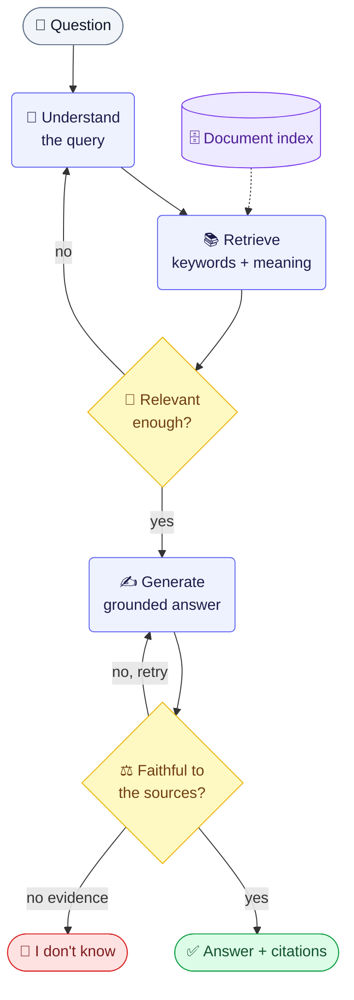
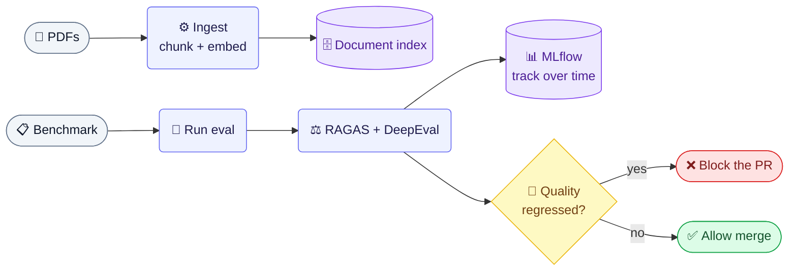

# VeriRAG

A **self-correcting, faithfulness-checked RAG** service over your PDFs — with a full **RAGOps**
loop around it: an automated quality benchmark, experiment tracking, and a CI gate that blocks any
change that makes answers worse.

VeriRAG doesn't just answer questions from documents. It **retrieves → reranks → generates →
grades its own answer**, retries when the evidence is weak, and **says "I don't know" instead of
hallucinating** when the answer isn't in the documents.

---

## ✨ What it does

- **Hybrid retrieval** — BM25 (keywords) + vector search (meaning), then a cross-encoder rerank.
- **Self-correction** — retries retrieval on weak context; regenerates on unfaithful answers.
- **Abstention** — refuses to answer when the documents don't support one (no hallucinations).
- **Grounded citations** — every answer cites the source document + page.
- **Provider-agnostic** — Gemini / OpenAI / Groq / Ollama, switched by one `.env` variable.
- **Evaluation harness** — RAGAS + DeepEval metrics on a fixed benchmark.
- **Experiment tracking** — every eval run logged to MLflow.
- **CI regression gate** — GitHub Actions blocks PRs that degrade answer quality.

---

## 🏗️ Architecture

**How a question flows through VeriRAG** — it keeps trying, and only answers when the sources back it up.



<sub>Maps to `app/graph.py`: **Understand** = `query_intelligence` · **Retrieve** = `hybrid_retrieve` · **Relevant?** = `rerank` (+ `Refine_query` loop) · **Generate** = `Compress → Generate` · **Faithful?** = `Faithfulness Judge` + `Abstention Threshold`.</sub>

**Behind the scenes** — how the index is built, and how quality is measured and guarded.



---

## 🚀 Quickstart

**1. Install**
```bash
python3.13 -m venv .venv && source .venv/bin/activate
pip install -r requirements.txt
pip install -r eval/requirements-eval.txt   # only if you want the eval/tracking tools
```

**2. Configure** — copy the template and set your provider + key:
```bash
cp .env.example .env
# e.g. LLM_PROVIDER=groq, LLM_MODEL=llama-3.3-70b-versatile, GROQ_API_KEY=...
```

**3. Add PDFs & build the index**
```bash
# put your .pdf files in documents/pdfs/
python -m app.ingest
```

**4. Run the API**
```bash
uvicorn app.main:app --reload
curl -X POST localhost:8000/query -H 'content-type: application/json' \
  -d '{"question":"<your question>"}'
```

Response:
```json
{
  "answer": "...",
  "citations": ["data1.pdf — p.3"],
  "faithfulness_score": 0.91,
  "abstained": false,
  "iterations": 0
}
```

---

## 📊 Evaluate & track quality

```bash
python -m eval.schema                     # validate the benchmark
python -m eval.runner --limit 12          # run + score (RAGAS + DeepEval), logs to MLflow
mlflow ui --backend-store-uri sqlite:///mlflow.db   # view runs → switch UI to "Model training"
python -m eval.gate                       # PASS / FAIL vs baseline (exit 1 on regression)
```

The same `runner` + `gate` run automatically in CI (`.github/workflows/eval-gate.yml`) on every PR.

---

## 🐳 Full stack (app + MLflow + Postgres)

```bash
docker compose up --build
# app → :8000   |   MLflow UI → :5000
```

---

## 📁 Project structure

```
app/                 FastAPI service + LangGraph pipeline
  main.py            /health, /query endpoints
  graph.py           pipeline assembly (nodes + retry/abstain edges)
  ingest.py          PDF → Chroma + BM25 index
  providers.py       provider-agnostic chat-model factory
  config.py          settings from .env
  nodes/             query_intelligence, retrieval, rerank, compression, generation, faithfulness
eval/                RAGOps: benchmark, runner (RAGAS+DeepEval), tracking (MLflow), gate
.github/workflows/   CI regression gate
docker-compose.yml   app + mlflow + postgres
```

See **[PROJECT_NOTES.md](PROJECT_NOTES.md)** for a deep dive (every file, tech justifications,
and the gotchas hit while building it).

---

## 🧰 Tech stack

FastAPI · LangGraph · LangChain · Chroma · BM25 · sentence-transformers (cross-encoder) ·
nomic embeddings · Groq / Ollama / Gemini / OpenAI · RAGAS · DeepEval · MLflow · Postgres ·
Docker · GitHub Actions
